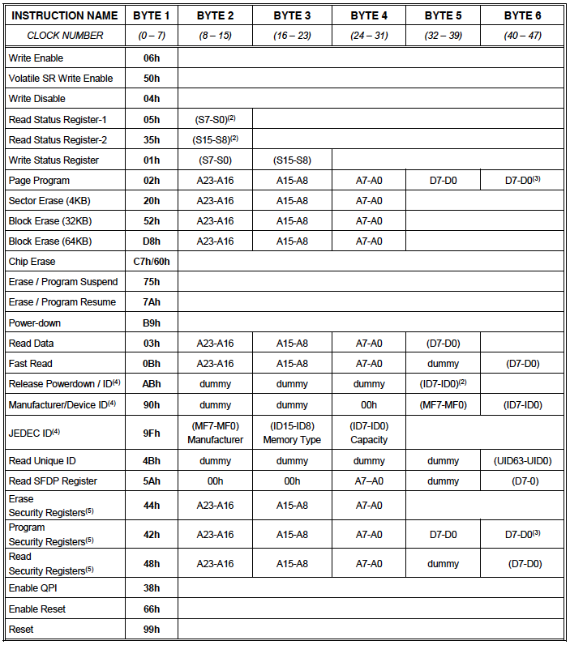

# SPI Flash (W74M64FV)について

## ステータスレジスター1 (S0-S7), 2 (S8-S15)

| ビット    | 内容                              |
|:----------|-----------------------------------|
| S0        | BUSY                              |
| S1        | WEL: Write Enable Latch           |
| S2 - S4   | BP0-2: Block Protect Bits         |
| S5        | TB: Top/Bottom Protect            |
| S6        | SEC: Sector Protect               |
| S7 - S8   | SRP0-1: Status Register Protect   |
| S9        | QE: Quad Enable                   |
| S10       | (reserved)                        |
| S11 - S13 | LB1-3: Security Register Lock Bits|
| S14       | CMP: Complement Protect           |
| S15       | SUS: Suspend Status               |

## 7.2 命令

W25Q64FVの標準SPI命令セットは、SPIバスを介して完全に制御される36個の基本命令で構成されている（7.2.2 命令セットを参照）。 命令は、チップセレクト（/CS）の立ち下がりエッジで開始される。DI入力に入力されるデータの最初のバイトが命令コードを提供する。DI入力のデータは、最上位ビット（MSB）が最初のクロックの立ち上がりエッジでサンプリングされる。

命令の長さは1バイトから数バイトまでさまざまで、その後にアドレスバイト、データバイト、ダミーバイト（何でも可）、場合によってはその組み合わせが続く場合がある。 命令は、/CSの立ち上がりエッジで完了する。すべての読み出し命令は、いつでも完了することができます。 しかし、Write、Program、Eraseのすべての命令は、バイト境界で完了する必要がある（8ビットを完全に処理した後に/CSをHighにする）。そうでない場合、命令は無視される。この機能により不注意による書き込みからデバイスが保護される。 さらに、メモリがプログラムまたは消去されている間、またはステータスレジスタに書き込みが行われている間は、ステータスレジスタのReadを除くすべての命令は、プログラムまたは消去サイクルが完了するまで無視される。

### 7.2.2 命令セット

**注**

1. データバイトは、MSB（最上位ビット）が最初にシフトされます。 括弧「（）」にデータがあるバイトフィールドは、IOピン1、2、4のいずれかでデバイスから出力されるデータを示します。
2. ステータスレジスタの内容とデバイスIDは、/CSが命令を終了するまで継続的に繰り返されます。
3. ページプログラム、クワッドページプログラム、およびプログラムセキュリティレジスタには、少なくとも1バイトから256バイトのデータ入力が必要です。 256バイトを超えるデータがデバイスに送信されると、アドレス指定はページの先頭にラップされ、以前に送信されたデータが上書きされます。

## 命令に関するメモ

- Write Enable (0x06): Page Program, 各種Erase, Write Status REgisterの発行前に毎度、必須
- Read Status Register-1 (0x05), 2 (0x35): いつでも発行可能
- Read Data (0x03): 続けて24bitの開始アドレスを指定。アドレスは自動インクリメントされ、データが次々出力される。/CSをHighにすると停止。
- Page Program (0x02): 1-256バイトをerase済みの場所に書き込み可能。事前にWrite Enable(0x06)の発行が都度必要。256バイトを書き込む場合はアドレスの最後のバイトが0でなければならない（256バイト境界）。256バイト境界を超えると先頭から上書き。境界を超えなければページ内の一部に書き込み可能。最後のバイトを出力後、/CSをHighにする必要あり。その後、self-timed Page Programが開始され、これが終わるまで他の命令は受け付けない。BUSY bitで判断。
- Sector Erase (0x20): 1セクタ(4KB)を消去（全バイトを0xff）。事前にWrite Enable(0x06)の発行が都度必要。
- 32KB Block Erase (0x52): 1ブロック(32KB)を消去（全バイトを0xff）。事前にWrite Enable(0x06)の発行が都度必要。
- 64KB Block Erase (0xD8): 1ブロック(64KB)を消去（全バイトを0xff）。事前にWrite Enable(0x06)の発行が都度必要。
- Chip Erase (0xC7/0x60): 装置全体を消去（全バイトを0xff）。事前にWrite Enable(0x06)の発行が必要。

# General Serial Flash Interface Intel IPについて

## SPI Flashのレジスタ

| オフセット | レジスタ名 | フィールド名 | Bit | デフォルト | 説明 |
|:-----|:-----------------|:-------------|:----|:-----------|:-----|
| 0x00 | Control Register | Addressing mode | 8   | 0x0 | 0x0: 3-bytes |
|      |                  | Chip select     | 7:4 | 0x0 | 0x0: Select 1st dev |
|      |                  | Enable          | 0   | 0x1 | 0x0: Disable the output of the IP |
| 0x04 | SPI Clock Baud-rate Register | Baund Rate Dividor | 4:0 | 0x10 | 分周比: 0x10=1/32 |
| 0x08 | CS Delay Setting Register    |              |  | 0x0 | 使用せず |
| 0x0C | Read Caturing Register       |              |  | 0x0 | 使用せず |
| 0x10 | Operating Protocols Setting Register |      |  | 0x0 | すべてStandard SPI modeで固定 |
| 0x14 | Read Instruction Register    | Dummy cycles | 12:8 | 0xA  | dummyサイクル数: 0x0に要設定|
|      |                              | Read opcode  | 7:0  | 0x03 | Read Dataコマンド |
| 0x18 | Write Instruction Register   | Poling opcode | 15:8 | 0x05  | Write操作完了をチェックするためのopcode|
|      |                              | Write opcode  | 7:0  | 0x02 | Write Dataコマンド |
| 0x1C | Flash Command Setting Register | No. of data bytes  | 15:12 | 0x8 | バイト数, Read: 0x1, Write: 0x2 |
|      |                 | Data type     | 11 | 0x1 | 0: Write, 1: Read |
|      |                 | No. of address bytes    | 10:8 | 0x0 | 0x0で固定 |
|      |                 | Opcode        | 7:0 | 0x05 | 0x05: Read 1, 0x35: Read 2, 0x01: Write  |
| 0x20 | Flash Command Control Register  | Start      | 0 | 0x0 | Write 1 to start operation  |
| 0x24 | Flash Command Address Register  | Starting address | 31:0 |       | Flashコマンドのアドレス |
| 0x28 | Flash Command Write Data 0 Register | Lower 4 bytes write data | 31:0 | 0x0 | Flashに書き込む最初の4バイト              |
| 0x2C | Flash Command Write Data 1 Register | Upper 4 bytes write data | 31:0 | 0x0 | Flashに書き込む最後の4バイト              |
| 0x30 | Flash Command Read Data 0 Register | Lower 4 bytes read data | 31:0 | 0x0 | Flashから読み込む最初の4バイト              |
| 0x34 | Flash Command Read Data 1 Register | Upper 4 bytes read data | 31:0 | 0x0 | Flashから読み込む最後の4バイト              |

## コントロールレジスタの使用手順

1. `avl_csr_waitrequest=0`の時に、`avl_csr_write` (write) または `avl_csr_read` (read) をアサート（し、`waitrequest=1`の間、`avl_csr_write=1`,`avl_csr_read=1`を保持）。
2. 同時に、`avl_csr_address`にアドレスをセット。writeの時はさらに`avl_csr_writedata`に書き込みデータをセット。
3. Readの場合は、`avl_csr_readdatavalid`がアサートされるのを待つ。
4. Writeの場合は、Write enable処理を先に行う。
5. WriteまたはEraseコマンドを発行した場合は、フラグステータスレジスタを常にReadする。

## メモリ操作

メモリアクセスについてはこのIPは次の操作を行う。モモリ操作自体は通常のAvalon-MM操作と同じ。

- Write操作のWrite enable処理
- 操作完了を確認するフラグレジスタのチェック
- 操作完了時の`waitrequest`のリリース。
